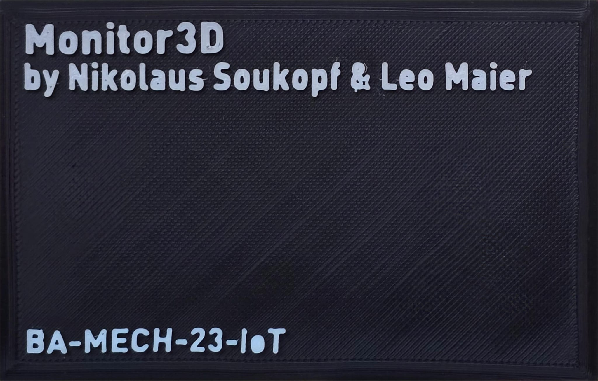

## Team
- **Nikolaus Soukopf**
- **Leo Maier**

## Projektbeschreibung
Dieses Projekt wurde im Rahmen der Vorlesung *Internet of Things II* des **Bachelor Mechatronik 2023**-Studiengangs am MCI realisiert.

Das Ziel ist es, einen **Ender 5 Pro** über die serielle Schnittstelle eines **Raspberry Pi** zu steuern und zu überwachen.

### Verwendete Technologien
- **Flask-Server** – Läuft auf dem Raspberry Pi, um über eine REST-API mit **Streamlit** zu kommunizieren
- **Streamlit** – Wird auf einem externen Docker-Container gehostet und stellt die Web-Oberfläche bereit
- **TinyDB** – Wird zur Aufzeichnung des **Filamentgewichts** genutzt

---
## Workflow – Einrichtung und Nutzung

1. **Montage:** Klemmen Sie die Vorrichtung zentriert auf das Aluprofil des **Ender 5 Pro**.
2. **Verbindung herstellen:** Schließen Sie den **Raspberry Pi** über ein USB-Kabel an die **serielle Schnittstelle** des Druckers an.
3. **Drucker einschalten.**
4. **Stromversorgung sicherstellen:** Versorgen Sie den **Raspberry Pi** mit einem Netzteil.
5. **Netzwerkverbindung:** Stellen Sie sicher, dass das WLAN-Netzwerk **iot-wlan-2024** aktiv ist.
6. **Bootvorgang abwarten:** Warten Sie, bis der Raspberry Pi vollständig gestartet ist.
7. **Login:** Melden Sie sich über die **Login-Maske** an.

---
## Funktionen der Web-Oberfläche

### **Printer-Steuerung**
#### **G-Code Verwaltung**
- **Datei-Upload:** G-Code-Dateien können direkt hochgeladen werden.
- **Datei-Liste aktualisieren:** Aktualisieren Sie die Liste der hochgeladenen G-Codes.
- **G-Code auswählen:** Wählen Sie eine Datei aus der Liste zur Ansicht aus.
- **G-Code anzeigen:**
  - Der Inhalt wird als **Text** und als **grafische Vorschau** visualisiert.
  - Die erste Anzeige kann etwas länger dauern, da die Datei analysiert und gerendert wird.

#### **Drucksteuerung**
- **Druck starten:** Der Druck kann **remote** per Knopfdruck begonnen werden.
- **Druck stoppen (Not-Halt):**
  - Falls notwendig, kann ein **Nothalt** über die Schaltfläche "Druck Stopp" ausgelöst werden.
  - Danach ist ein **physischer Reset** des Druckers über **Power-Cycle** erforderlich.

#### **Live-Überwachung**
- **Live-Stream:**
  - Ein Video-Feed des Druckbetts ermöglicht die visuelle Überwachung des Druckprozesses.
- **Status-Anzeige:**
  - **Druckkopf-Temperatur** (Nozzle)
  - **Heizbett-Temperatur**
  - **Druckkopf-Koordinaten** (X/Y/Z-Position)
  - **Lüftergeschwindigkeit** *(Platzhalter, derzeit nicht implementiert)*